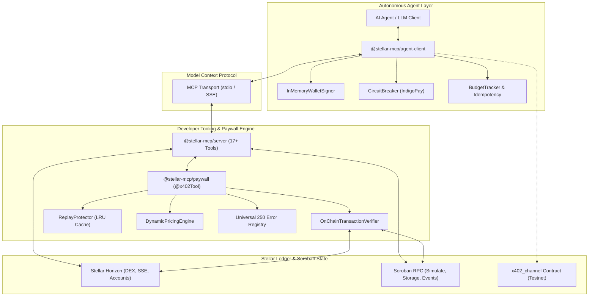

# stellar-x402-mcp

[](https://github.com/stellar-x402-mcp/monorepo/actions/workflows/ci.yml)
[](https://stellar-x402-mcp.vercel.app)
[](https://stellar.expert/explorer/testnet/contract/CDAVUNF5DHX2MWF33XDMY7WKVBSQZ3SXZDT2TPSNZPEB3Z4HHPPKTVGY)
[](LICENSE)
[](packages/)
[](https://github.com/stellar-x402-mcp/docs)

Model Context Protocol (MCP) server, institutional developer tooling system, and multi-payment settlement framework for Stellar and Soroban.

`stellar-x402-mcp` connects autonomous AI agents (Claude Desktop, Cursor, LangChain, AutoGPT) to Stellar Horizon and Soroban RPC, while empowering tool developers to monetize agent invocations via HTTP 402 micro-payments across 7 distinct Stellar payment modalities.

---

## Drips & Grantfox Submission Links

For evaluators, reviewers, and grant administrators:

| Resource | Target Link | Description |
|---|---|---|
| **GitHub Repository** | [github.com/stellar-x402-mcp/monorepo](https://github.com/stellar-x402-mcp/monorepo) | Monorepo source code, contracts, and CI/CD |
| **Official Documentation (Mintlify)** | [github.com/stellar-x402-mcp/docs](https://github.com/stellar-x402-mcp/docs) | Complete Mintlify documentation and integration guides |
| **Interactive Showcase (Vercel)** | [stellar-x402-mcp.vercel.app](https://stellar-x402-mcp.vercel.app) | Live tool runner, x402 simulator, and error registry |
| **Testnet Contract (Stellar.expert)** | [stellar.expert/testnet/contract/...](https://stellar.expert/explorer/testnet/contract/CDAVUNF5DHX2MWF33XDMY7WKVBSQZ3SXZDT2TPSNZPEB3Z4HHPPKTVGY) | Verified state channel contract and upload transactions |
| **Stellar Laboratory (Testnet)** | [lab.stellar.org/testnet/contract/...](https://lab.stellar.org/r/testnet/contract/CDAVUNF5DHX2MWF33XDMY7WKVBSQZ3SXZDT2TPSNZPEB3Z4HHPPKTVGY) | Live Soroban RPC contract inspection harness |
| **Planning & Architecture Records** | [github.com/EmeditWeb/stellar-agentic-planning](https://github.com/EmeditWeb/stellar-agentic-planning) | ADR-001 through ADR-012 and complete roadmap |
| **Gas Benchmarks** | [contracts/x402_channel/BENCHMARKS.md](contracts/x402_channel/BENCHMARKS.md) | Profiled CPU instructions, memory bytes, and savings |
| **250 Error Codes Registry** | [packages/paywall/src/errors/](packages/paywall/src/errors/) | Exhaustive machine-readable error classification |

---

## Architectural Highlights



---

## Seven Stellar Payment Modalities Supported

`stellar-x402-mcp` is an open-source tooling system supporting multiple Stellar payment mechanisms:

1. **Native XLM Instant Payments**: Zero-dependency micro-settlement via standard Stellar payment operations.
2. **Soroban SAC Token Transfers**: High-precision USDC and custom SAC token transfers with cryptographic envelope simulation.
3. **Path Payments (Strict Send & Strict Receive)**: Automatic multi-hop routing across DEX orderbooks and liquidity pools. Agents can pay in their preferred asset while services receive settlement in requested assets.
4. **Claimable Balances**: Conditional escrow settlements with time predicates for asynchronous multi-agent coordination.
5. **Fee-Bump Transactions**: Relayer-sponsored transactions allowing agents to execute paywalled tools without maintaining native XLM reserves for gas.
6. **Pre-Funded State Channels (`x402_channel`)**: Off-chain bilateral vouchers signed by agent wallets, enabling zero-fee instant micro-invocations settled on-chain cumulatively.
7. **AMM Liquidity Swaps**: Direct execution against automated market maker liquidity pools.

---

## Soroban State Channel Contract & Ultra-Low Gas Profile

Deployed to **Stellar Testnet**:
- **Contract Address**: `CDAVUNF5DHX2MWF33XDMY7WKVBSQZ3SXZDT2TPSNZPEB3Z4HHPPKTVGY`
- **WASM Bytecode Hash**: `dcf795a2daff9472f0796ca0188e4f5cae0c868a68cd70dc755557708b4efdb3`
- **Optimized Binary Size**: 5,908 bytes (under 6KB)
- **Deployment Transaction**: [`55324f4c7277b8596452723f894fce3061a019e7cf98d080f2dfea65f5144935`](https://stellar.expert/explorer/testnet/tx/55324f4c7277b8596452723f894fce3061a019e7cf98d080f2dfea65f5144935)

### Gas Benchmark Comparison (1,000 Micro-Invocations)

| Settlement Mechanism | On-Chain Txs | CPU Instructions | Network Fee | Latency per Tool Call |
|---|---|---|---|---|
| Direct Stellar Classic | 1,000 | N/A | 100,000 stroops | 3-5 seconds |
| Direct Soroban SAC | 1,000 | ~250,000,000 | ~1,500,000 stroops | 3-5 seconds |
| **x402 State Channel (Ours)** | **2** (Open + Close) | **611,462** (99.75% less) | **200 stroops** (99.8% fee savings) | **< 2 ms** (instant local voucher) |

Full methodology and profiling logs in [contracts/x402_channel/BENCHMARKS.md](contracts/x402_channel/BENCHMARKS.md).

---

## Universal 250 Error Codes Registry

Standardized, machine-readable error codes covering all failure modes across the protocol:

- **1000 to 1039 (40 codes)**: Protocol and Transport Errors (MCP JSON-RPC, SSE framing, payload limits)
- **1040 to 1079 (40 codes)**: Horizon and Ledger State Errors (sequence mismatch, trustline missing, reserve limits)
- **1080 to 1119 (40 codes)**: Soroban RPC and Simulation Errors (host traps, CPU/memory limits, storage TTL expiration)
- **1120 to 1159 (40 codes)**: Paywall and Verification Errors (HTTP 402 challenges, price slippage, signature faults)
- **1160 to 1189 (30 codes)**: Anti-Replay and Storage Errors (claimed nonces, duplicate tx hashes, LRU cache faults)
- **1190 to 1219 (30 codes)**: Autonomous Agent and Wallet Errors (budget caps, circuit breaker trips, key derivation)
- **1220 to 1249 (30 codes)**: DEX, Liquidity Pool and Path Payment Errors (empty orderbooks, pool imbalances, path limits)

Every error code provides `code`, `slug`, `category`, `httpStatus`, `retryable` boolean, `message`, and deterministic `remedy` instructions.

---

## Complete MCP Tool Catalog (17 Tools)

| Tool Name | Parameters | Category | Description |
|---|---|---|---|
| `stellar_get_balance` | `accountAddress`, `network` | Horizon | Queries native XLM and SAC token balances |
| `stellar_get_account` | `accountAddress`, `network` | Horizon | Queries sequence number, signers, and thresholds |
| `stellar_get_account_details` | `accountAddress`, `network` | Horizon | Comprehensive inspection including subentry counts, flags, and balances |
| `stellar_get_orderbook` | `sellingAsset`, `buyingAsset`, `limit`, `network` | Horizon | Real-time DEX orderbook depth, bids, asks, and spreads |
| `stellar_get_liquidity_pools` | `poolId`, `reserves`, `account`, `cursor`, `limit`, `network` | Horizon | AMM reserve balances, fee tiers, and total pool shares |
| `stellar_get_claimable_balances` | `claimant`, `sponsor`, `asset`, `balanceId`, `network` | Horizon | Inspects pending claimable balance escrows and time predicates |
| `stellar_stream_ledger_events` | `streamType`, `account`, `cursor`, `limit`, `network` | Horizon | Live Server-Sent Events (SSE) stream for ledger headers and payments |
| `stellar_find_payment_paths` | `sourceAccount`, `destinationAccount`, `destinationAsset`, `destinationAmount` | Horizon | Finds optimal strict-receive liquidity paths |
| `stellar_swap_tokens` | `sourceAccount`, `sendAsset`, `sendMax`, `destAsset`, `destAmount`, `signedEnvelopeXdr` | Horizon | Constructs or submits DEX path payment swap transactions |
| `stellar_submit_transaction` | `signedEnvelopeXdr`, `network` | Horizon | Broadcasts signed transaction envelope to the ledger |
| `soroban_simulate_invocation` | `transactionXdr`, `contractId`, `method`, `args`, `network` | Soroban | Dry-runs invocation to extract CPU/memory footprint and auth entries |
| `soroban_simulate_contract` | `contractId`, `method`, `args`, `transactionXdr`, `network` | Soroban | Dry-runs contract method and returns parsed ScVal return value |
| `soroban_invoke_contract` | `contractId`, `method`, `args`, `secretKey`, `network` | Soroban | Signs, simulates, and submits Soroban contract transaction |
| `soroban_query_events` | `startLedger`, `contractIds`, `topics`, `cursor`, `limit` | Soroban | Queries contract event logs with topic and ledger filters |
| `soroban_get_ledger_entries` | `keys`, `contractId`, `keySymbol`, `durability`, `network` | Soroban | Inspects low-level contract storage entries via base64 XDR |
| `soroban_get_transaction` | `hash`, `network` | Soroban | Polls transaction status and inspects execution metadata XDR |
| `soroban_get_latest_ledger` | `network` | Soroban | Queries latest ledger sequence, protocol version, and close time |
| `soroban_get_network` | `network` | Soroban | Inspects network passphrase, protocol version, and friendbot URL |
| `soroban_assemble_transaction` | `transactionXdr`, `network` | Soroban | Builds valid transaction envelope with simulation footprint |
| `soroban_read_storage` | `contractId`, `key`, `keyType`, `durability`, `network` | Soroban | High-level deserializer converting ScVal storage into typed JSON |

---

## Production Resilience & IndigoPay Hardening

Modeled after `Stellar-IndigoPay` (Issue #1098, PR #1211):
- **`CircuitBreaker`**: Fast-fails with 0 network calls during upstream RPC outages.
- **Jittered Exponential Backoff**: Uniform random jitter preventing thundering-herd congestion.
- **Finality Polling (`pollTransactionUntilFinal`)**: Strictly rejects intermediate `PENDING` states until terminal `SUCCESS` or `FAILED`.
- **Fee-Bump Escalation**: Builds sponsored fee-bumps when transactions stall under network spikes.
- **Hash-Level Idempotency**: Anchors on envelope hash to guarantee exactly-once payment execution.

---

## Agent Framework Adapters (`@stellar-mcp/adapters`)

Native adapters connecting Stellar MCP tools directly into leading autonomous agent frameworks with automatic x402 payment resolution:

### Vercel AI SDK Core (`ai`)

```typescript
import { generateText } from 'ai';
import { openai } from '@ai-sdk/openai';
import { createVercelAITools } from '@stellar-mcp/adapters/vercel';
import { X402AgentMcpClient } from '@stellar-mcp/agent-client';

const client = new X402AgentMcpClient({ secretKey: process.env.STELLAR_SECRET_KEY });
const tools = createVercelAITools(mcpTools, client);

const { text } = await generateText({
  model: openai('gpt-4o'),
  tools,
  prompt: 'Check balance for account GABCD and simulate contract CXYZ',
});
```

### LangChain.js (`@langchain/core`)

```typescript
import { createLangChainTools } from '@stellar-mcp/adapters/langchain';
import { initializeAgentExecutorWithOptions } from 'langchain/agents';

const langchainTools = createLangChainTools(mcpTools, client);
const executor = await initializeAgentExecutorWithOptions(langchainTools, llm, {
  agentType: 'structured-chat-zero-shot-react-description',
});
```

### LlamaIndex.TS (`llamaindex`)

```typescript
import { createLlamaIndexTools } from '@stellar-mcp/adapters/llamaindex';
import { ReActAgent } from 'llamaindex';

const llamaTools = createLlamaIndexTools(mcpTools, client);
const agent = new ReActAgent({ tools: llamaTools });
```

---

## Standalone CLI & Config Templates (`@stellar-mcp/cli`)

The `stellar-mcp` CLI provides commands for running servers, inspecting state, managing keys, and profiling gas:

```bash
# Run MCP server over stdio or SSE
stellar-mcp serve --transport stdio --network testnet
stellar-mcp serve --transport sse --port 3000 --network testnet

# Inspect Stellar account or Soroban contract
stellar-mcp inspect GDCU3C3O7J2D4XJBE7FHD25VDLCPWZVDHCSH5XVLF7ZUZLFEE6KRS6RX
stellar-mcp inspect CDAVUNF5DHX2MWF33XDMY7WKVBSQZ3SXZDT2TPSNZPEB3Z4HHPPKTVGY

# Generate fresh Ed25519 keypair and fund via Friendbot
stellar-mcp wallet generate
stellar-mcp wallet fund GDCU3C3O7J2D4XJBE7FHD25VDLCPWZVDHCSH5XVLF7ZUZLFEE6KRS6RX

# Simulate x402 payment challenge, authorization, and receipt settlement
stellar-mcp simulate --tool soroban_execute_settlement --price 0.05 --asset USDC

# Display gas, CPU instruction, and fee benchmarks
stellar-mcp benchmark
```

### IDE Configuration Templates

- **Claude Desktop**: Copy `templates/claude_desktop_config.json` to `~/Library/Application Support/Claude/claude_desktop_config.json` (macOS) or `%APPDATA%\Claude\claude_desktop_config.json` (Windows).
- **Cursor**: Copy `.cursor/mcp.json` into your workspace root.
- **Docker**: Run `docker compose up --build` to deploy the SSE server at port 3000.

---

## Open Source Tooling Governance

Designed to accommodate 100+ community issues, contributors, and tooling extensions:
- **Issue Templates**: Structured forms for [Tool Requests](.github/ISSUE_TEMPLATE/tool_request.yml), [Payment Settlement Adapters](.github/ISSUE_TEMPLATE/payment_method.yml), and [Bug Reports](.github/ISSUE_TEMPLATE/bug_report.yml).
- **PR Template**: Rigorous [Pull Request Checklist](.github/PULL_REQUEST_TEMPLATE.md) modeled after PR #1211.
- **Automated CI/CD**: Continuous integration on GitHub Actions with Vercel deployment automation.

---

## Development & Testing

```bash
# Install dependencies across all workspaces
pnpm install

# Run 113 tests across all packages
pnpm test

# Typecheck with strict TypeScript and exactOptionalPropertyTypes
pnpm typecheck

# Build dual ESM/CJS and type declarations via tsup
pnpm build

# Run Soroban smart contract tests and gas benchmarks
cargo test --manifest-path contracts/x402_channel/Cargo.toml

# Build optimized WASM bytecode (5,908 bytes)
stellar contract build --manifest-path contracts/x402_channel/Cargo.toml
```

---

## License

Apache-2.0. See [LICENSE](LICENSE) for details.
