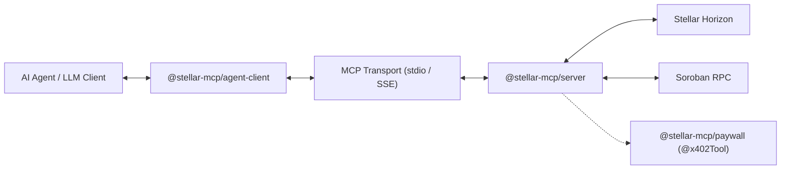

# stellar-x402-mcp

[](https://github.com/stellar-x402-mcp/monorepo/actions/workflows/ci.yml)
[](LICENSE)

Model Context Protocol (MCP) server and agent monetization framework for the Stellar network. It provides AI agents with typed tools to read account balances, inspect Soroban state, simulate invocations, index contract events, and route DEX path payments. It also exports the `@x402Tool` decorator to monetize custom tools via HTTP 402 challenges settled in Stellar stablecoins, backed by automated client signing and budget policies.

---

## Architecture Overview

The system consists of three core packages operating across the agent invocation lifecycle:



---

## Workspace Packages

### 1. `@stellar-mcp/server` (`packages/server`)
Model Context Protocol server implementing typed tool interfaces over both `stdio` and `SSE` transports.
- Transports: Standard Input/Output (desktop agents) and Server-Sent Events (web agents).
- Network support: Testnet and Pubnet via `--network` flag or configuration objects.

### 2. `@stellar-mcp/paywall` (`packages/paywall`)
Monetization wrapper implementing the x402 payment challenge protocol for MCP tools.
- `@x402Tool`: Higher-order decorator wrapping tool handlers to enforce settlement before execution.
- Challenge schema: Returns CAIP-2 network identifiers, asset addresses, price per invocation, recipient public keys, and cryptographic validity windows.
- Throws structured `PaymentRequiredError` when unauthenticated.

### 3. `@stellar-mcp/agent-client` (`packages/client`)
Autonomous client wrapper that consumes MCP tools and handles paywall handshakes.
- Handshake resolution: Catches 402 challenges, requests signing from local wallet, and retries calls automatically.
- `BudgetTracker`: Enforces fail-closed guardrails (`maxSpendPerCall` and `maxDailySpend`) to prevent resource exhaustion.
- Wallet isolation: Private keys and seed bytes remain strictly in memory and are never serialized or transmitted.

---

## Implemented Tool Catalog

| Tool Name | Parameters | Description |
|---|---|---|
| `stellar_get_balance` | `accountAddress`, `network` | Fetches native XLM and SAC token balances from Horizon |
| `soroban_simulate_contract` | `contractId`, `method`, `args`, `network` | Simulates Soroban smart contract invocations without submitting to ledger |
| `soroban_query_events` | `startLedger`, `contractIds`, `topics`, `cursor`, `limit`, `network` | Queries Soroban contract event logs by contract ID, topic XDR, and ledger ranges |
| `soroban_get_ledger_entries` | `keys`, `contractId`, `keySymbol`, `durability`, `network` | Reads contract data and instance storage keys directly from Soroban RPC ledger state |
| `soroban_get_transaction` | `hash`, `network` | Polls and inspects Soroban transaction status, execution results, and metadata XDR |
| `stellar_find_payment_paths` | `sourceAccount`, `destinationAccount`, `destinationAsset`, `destinationAmount`, `network` | Queries Horizon strict-receive payment paths across DEX orderbooks and liquidity pools |
| `stellar_swap_tokens` | `sourceAccount`, `sendAsset`, `sendMax`, `destAsset`, `destAmount`, `destinationAccount`, `path`, `signedEnvelopeXdr`, `network` | Builds path payment swap transaction envelope XDR or submits signed swap envelope |
| `stellar_submit_transaction` | `signedEnvelopeXdr`, `network` | Posts signed transaction envelope XDR directly to the Stellar ledger |

---

## Desktop Client Configuration

### Claude Desktop
Add the following configuration to your `claude_desktop_config.json`:

```json
{
  "mcpServers": {
    "stellar": {
      "command": "npx",
      "args": ["-y", "@stellar-mcp/server", "--network", "testnet"]
    }
  }
}
```

Configuration templates are available in [templates/claude_desktop_config.json](templates/claude_desktop_config.json).

### Cursor IDE
Add the following configuration to `.cursor/mcp.json` in your workspace:

```json
{
  "mcpServers": {
    "stellar": {
      "command": "node",
      "args": ["packages/server/dist/index.js"]
    }
  }
}
```

Configuration templates are available in [templates/cursor_mcp_config.json](templates/cursor_mcp_config.json).

---

## Monetizing Custom Tools with `@x402Tool`

Tool authors can gate high-compute or premium data tools behind micro-payments:

```typescript
import { x402Tool } from '@stellar-mcp/paywall';

export const analyzePortfolio = x402Tool({
  price: '0.005', // 0.005 USDC per call
  asset: 'CDLZFC3SYJYDZT7K67VZ75HPJVIEUVNIXF47ZG2FB2RMQQVU2HHGCYSC',
  recipient: 'GD...',
  network: 'stellar:testnet',
  handler: async (args) => {
    return {
      status: 'analyzed',
      recommendation: 'rebalance',
    };
  },
});
```

When called without valid authorization, the tool throws a `PaymentRequiredError` containing the 402 challenge parameters:

```json
{
  "version": "x402-v1",
  "network": "stellar:testnet",
  "asset": "CDLZFC3SYJYDZT7K67VZ75HPJVIEUVNIXF47ZG2FB2RMQQVU2HHGCYSC",
  "price": "0.005",
  "recipient": "GD...",
  "validUntil": 1725712000
}
```

---

## Consuming Paywalled Tools with `@stellar-mcp/agent-client`

Autonomous agents configure budget guardrails and automated signing callbacks:

```typescript
import { X402AgentMcpClient } from '@stellar-mcp/agent-client';

const client = new X402AgentMcpClient({
  payerAddress: 'GB...',
  budgetPolicy: {
    maxSpendPerCall: 0.05, // Maximum 0.05 tokens per single invocation
    maxDailySpend: 1.0,    // Maximum 1.0 token total per 24 hours
  },
  signAuthorization: async (challenge) => {
    // Sign challenge authorization entry using in-memory keypair
    return signChallenge(challenge);
  },
});

// Invocation automatically intercepts 402, verifies budget, signs, and retries
const result = await client.invokeTool(analyzePortfolio, { target: 'treasury' });
```

---

## Development & Verification

### Prerequisites
- Node.js 22 LTS (`.nvmrc`)
- pnpm 11.1.3 (`packageManager` in `package.json`)

### Commands
```bash
# Install dependencies across all workspaces
pnpm install

# Run Vitest test suite across all packages
pnpm test

# Typecheck all packages with strict TypeScript compiler
pnpm typecheck

# Build dual ESM/CJS and type declarations via tsup
pnpm build
```

---

## Security Invariants

1. **In-Memory Key Handling**: Secret keys and seed bytes are never accepted as tool input parameters, never returned in tool payloads, and never printed in logs.
2. **Fail-Closed Budget Guardrails**: When daily or per-call budget caps are exceeded, the client aborts execution before requesting any cryptographic signatures.
3. **Deterministic Error Formats**: Payment challenges follow explicit JSON schemas containing expiration timestamps to prevent replay attacks.

---

## License

Apache-2.0. See [LICENSE](LICENSE) for details.
