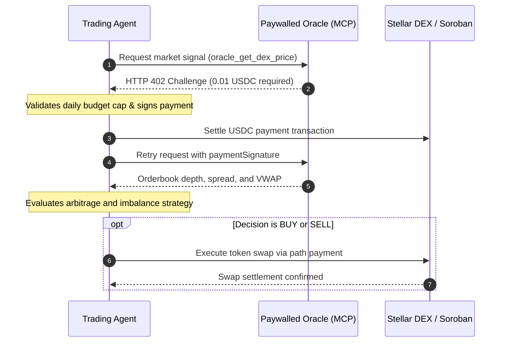

# @stellar-mcp/trading-agent

A production reference autonomous AI trading agent built on Stellar and Soroban. The agent demonstrates how an autonomous consumer uses `@stellar-mcp/agent-client` to pay for real-time market intelligence from paywalled MCP oracles via HTTP 402 micropayments, evaluates DEX orderbook arbitrage opportunities, and executes trades with strict daily budget guardrails.

---

## 1. Overview & Architecture



---

## 2. Safety Guardrails & Budget Management

The agent uses `@stellar-mcp/agent-client` with institutional safety features:

1. **Daily Spending Caps**: Restricts cumulative 24-hour oracle spend via `BudgetTracker`.
2. **Per-Invocation Thresholds**: Automatically rejects any tool call charging more than `maxPaymentPerInvocation`.
3. **Circuit Breaker**: Detects repeated RPC timeouts or upstream failures and fails fast without burning fees.
4. **Hash-Level Idempotency**: Guarantees that payment authorizations cannot be double-spent across retries.

---

## 3. Configuration & Environment Variables

| Variable | Default | Purpose |
|---|---|---|
| `AGENT_SECRET_KEY` | auto-generated | Ed25519 secret seed for signing payments and swaps |
| `AGENT_DAILY_BUDGET` | `5.0` | Maximum USDC spend per 24 hours on paywalled tools |
| `AGENT_MAX_PER_CALL` | `0.05` | Maximum USDC payment per individual tool invocation |
| `AGENT_BASE_ASSET` | `native` | Target base asset to trade (e.g. XLM) |
| `AGENT_QUOTE_ASSET` | SAC USDC | Target quote asset for pricing and settlement |
| `AGENT_MIN_PROFIT_BPS` | `50` | Minimum spread threshold in basis points to trigger trades |
| `AGENT_MAX_TRADE_AMOUNT` | `10.0` | Maximum trade size in base asset units |
| `AGENT_POLL_INTERVAL_MS` | `5000` | Polling frequency for iterative market evaluation |

---

## 4. Running the Agent

### Single Evaluation Cycle

```bash
pnpm --filter @stellar-mcp/trading-agent start
```

### Programmatic Integration

```typescript
import { AutonomousTradingAgent } from '@stellar-mcp/trading-agent';

const agent = new AutonomousTradingAgent({
  dailyBudgetUsdc: 2.0,
  maxPaymentPerInvocation: 0.02,
  minProfitBps: 40,
});

const result = await agent.step();
console.log('Trade Decision:', result.decision.action, result.decision.reason);
```

---

## 5. Development & Testing

```bash
# Run unit and strategy test suite
pnpm --filter @stellar-mcp/trading-agent test

# Build production distribution
pnpm --filter @stellar-mcp/trading-agent build

# Verify strict TypeScript typechecking
pnpm --filter @stellar-mcp/trading-agent typecheck
```
